# Webcam streaming example using HLS

## Table of Contents <!-- omit in toc -->

- [Webcam streaming example using HLS](#webcam-streaming-example-using-hls)
  - [Environments](#environments)
    - [Composition diagram](#composition-diagram)
    - [Getting started](#getting-started)
  - [Knowledge](#knowledge)
    - [FFmpeg options](#ffmpeg-options)
    - [Content-Type](#content-type)


## Environments

### Composition diagram

```mermaid
flowchart LR
  subgraph node1[tools/webcam1.sh]
    n1u1[📹 ffmpeg]
  end

  node2[(🖼️ playlist.m3u8 )]
  node1 --> node2

  subgraph node3[flask]
    n2u1(send_from_directory)
  end
  node2 --> node3

  subgraph node4[browser]
    subgraph html1[hls.js demo]
      video1{{📹 video}}
    end
  end
  node3 --"http:5002"--> node4

  subgraph node5[browser]
    subgraph html2[index.html]
      VIDEO2{{📹 video}}
    end
  end
  node3 --"http:5002"--> node5

```




### Getting started

Install ffmpeg on macOS.

```shell
brew install ffmpeg
```

Change the current directory of the script that launches ffmpeg.
The script creates a file for streaming in the current directory.

Check the destination with video_dir in __route__.py, or specify  
it with the environment variable `HLS_DIR_SRC`.

```shell
cd /workspaces/examples-py-web/temp/hls

or

export HLS_DIR_SRC=`pwd`
```

If you're not using macOS, change the codec spec in `webcam2_hls.sh`.

Start your webcam:

```shell
../../src/examples-flask-media/tools/webcam2_hls.sh
```

Run service:

```shell
flask run --debug
```

It will be hosted at the following URL:

- <http://127.0.0.1:5000/>

or

You can check it out on this website.

- [HLS.js site](https://hlsjs.video-dev.org/demo/)

Enter `http://127.0.0.1:5000/webcam/hls/video/playlist.m3u8` into the URL.


## Knowledge

### FFmpeg options

- [HLS - Formats](https://ffmpeg.org/ffmpeg-formats.html#hls-2)


### Content-Type

[RFC 8216 - HTTP Live Streaming](https://tex2e.github.io/rfc-translater/html/rfc8216.html#4--Playlists):

- `application/vnd.apple.mpegurl` or `audio/mpegurl`

Microsoft?

- `application/x-mpegURL`
