# Webcam streaming example for MJPEG

## Table of Contents <!-- omit in toc -->

- [Webcam streaming example for MJPEG](#webcam-streaming-example-for-mjpeg)
  - [Environments](#environments)
    - [Composition diagram](#composition-diagram)
    - [Getting started](#getting-started)
  - [Knowledge](#knowledge)
    - [FFmpeg options](#ffmpeg-options)
    - [MJPEG over HTTP](#mjpeg-over-http)
    - [Multipart responses](#multipart-responses)


## Environments

### Composition diagram

```mermaid
flowchart LR
  subgraph node1[tools/webcam1.sh]
    n1u1[📹 ffmpeg]
  end

  subgraph node2[flask]
    n2u1(cv2.VideoCapture)
    n2u2[/🖼️ image/jpeg/]
    n2u1 --> n2u2
  end
  node1 --"udp:5501"--> node2

  subgraph node3[browser]
    subgraph html[index.html]
      imd{{📹 img}}
    end
  end
  node2 --"http:5000"--> node3
```



### Getting started

Install ffmpeg on macOS.

```shell
brew install ffmpeg
```

If you're not using macOS, change the codec spec in `webcam1.sh`.

Start your webcam:

```shell
tools/webcam1.sh
```

Run service:

```shell
flask run --debug
```

It will be hosted at the following URL:

- <http://127.0.0.1:5000/>


## Knowledge

### FFmpeg options

- [VideoToolbox - HWAccelIntro](https://trac.ffmpeg.org/wiki/HWAccelIntro#VideoToolbox)

### MJPEG over HTTP

Returning JPEG over HTTP using `multipart/x-mixed-replace` and rendering it as video is sometimes called MJPEG over HTTP, or simply MJPEG or Motion JPEG.

### Multipart responses

```html
Content-Type: multipart/x-mixed-replace: boundary=frame
```

`multipart/x-mixed-replace` is a MIME type that allows the server to return multiple documents at any time in an HTTP response, switching the rendering in a picture-theater style (or slideshow).

The boundary (delimiter) is a required parameter, and the specified string is preceded by `--` to separate the parts.
