# Example of segmented video streaming

## Table of Contents <!-- omit in toc -->

- [Environments](#environments)
  - [Composition diagram](#composition-diagram)
- [Getting started](#getting-started)
- [Knowledge](#knowledge)
  - [206 Partial Content](#206-partial-content)

## Environments

### Composition diagram

```mermaid
flowchart LR

  Node1[(🖼️ input.mp4)]

  subgraph Node2[flask]
    N2U1(BufferedReader)
  end
  Node1 --> Node2

  subgraph Node3[browser]
    subgraph HTML
      IMG{{📹 video}}
    end
  end
  Node2 --"http:5000"--> Node3
```



## Getting started

Get free MPEG4 video files.

for example:

```shell
curl -OL https://www.home-movie.biz/mov/hts-samp005.mp4
```

Set the environment variables as needed:

```shell
export VIDEO_SRC=$PWD/hts-samp005.mp4
```

Run service:

```shell
flask run --debug
```

It will be hosted at the following URL:

- <http://127.0.0.1:5000/>

## Knowledge

### 206 Partial Content

When hosting videos using the video tag, it seems that response code 200 may not allow operations such as fast forwarding, and response code 206 may be forced.

- [&lt;video&gt; - mdn](https://developer.mozilla.org/ja/docs/Web/HTML/Element/video)
- [206 Partial Content - mdn](https://developer.mozilla.org/ja/docs/Web/HTTP/Status/206)
